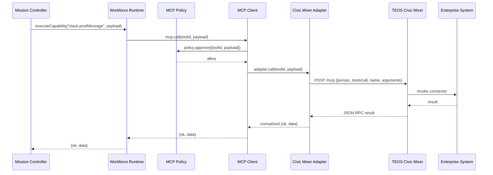
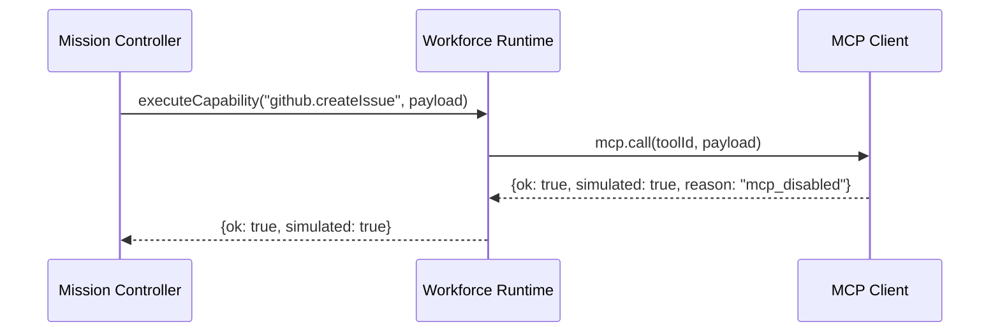
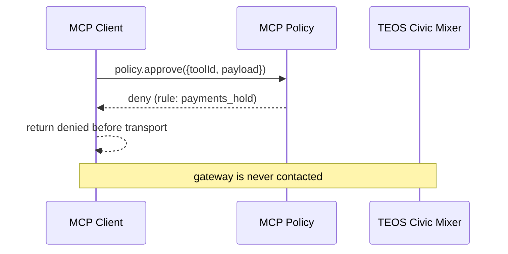
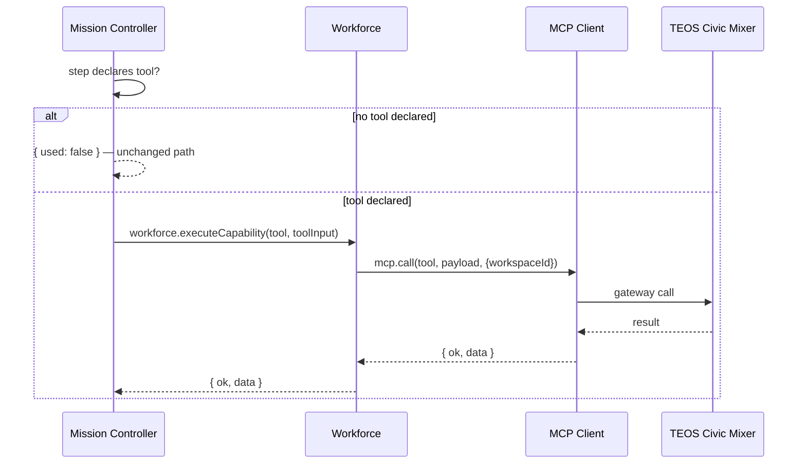

# TEOS DEALMAKER — MCP Architecture (Phase 3)

## Positioning

TEOS DEALMAKER is an **MCP client**, not an MCP server.

Every external action an agent wants to take (GitHub, PostgreSQL, Redis, Docker,
Playwright/Browser, Supabase, Stripe, Slack, Notion, CRM, filesystem) is sent to
**TEOS Civic Mixer** — the shared enterprise MCP Gateway owned by Elmahrosa
International. DealMaker orchestrates governed revenue missions; it never
implements enterprise connectors itself.

```
Telegram / Web / API
        │
        ▼
Mission Controller ──► Workforce Runtime ──► MCP Client ──► TEOS Civic Mixer ──► MCP Servers ──► Enterprise Tools
```

## Package layout

```
services/mcp/
    index.js              facade (execute/discover/health/listTools + env default instance)
    client.js             single call()/execute() interface, health(), discover()
    registry.js           tool discovery, capabilities, versioning, register/unregister
    policy.js             enterprise policy engine (allow list, workspace isolation, audit, future RBAC)
    adapters/
        index.js          per-server adapter selection
        civicMixer.js     HTTP JSON-RPC transport to TEOS Civic Mixer
```

Only `services/workforce` may hand a mission step a tool call. The mission
controller exposes `executeCapability(adapter, workspaceId, stepOrTool, payload)` and
delegates to `workforce.executeCapability`, which routes through `services/mcp`.
Nothing calls the Civic Mixer SDK or an enterprise API directly.

```javascript
const mc = require('./services/mission-controller');
await mc.executeCapability(adapter, ws.id, 'github.createIssue', {
  owner: 'elmahrosa',
  repo: 'teos-dealmaker',
  title: 'Prospect follow-up'
});
```

## Configuration

MCP is **completely optional**. When disabled, every tool request returns a
simulated no-op and the platform runs exactly as before.

| Variable      | Meaning                                      | Default |
|---------------|----------------------------------------------|---------|
| `MCP_ENABLED` | `true` enables the gateway path               | off     |
| `MCP_ENDPOINT`| TEOS Civic Mixer base URL (no hardcoding)     | —       |
| `MCP_API_KEY` | Bearer key sent to the gateway                | —       |
| `MCP_TIMEOUT` | Request timeout in milliseconds               | `15000` |

Enabled but unconfigured (no endpoint) also stays simulated, so a partial
deployment cannot break an existing mission.

## Call pipeline (enabled)



## Disabled mode (today's behavior preserved)



No network, no policy, no behavior change.

## Policy denial



## Mission step tool execution

A mission step may declare `tool:` (and optional `toolInput:`). The mission
controller routes only those steps to the MCP gateway, through the workforce —
agents are never touched and ordinary steps are unchanged.

```javascript
const mc = require('./services/mission-controller');
await mc.executeCapability(adapter, ws.id, {
  step_key: 'notify',
  tool: 'slack.postMessage',
  toolInput: { channel: '#sales', text: 'Mission milestone reached' }
});
```



## Policy engine

`services/mcp/policy.js` is the enterprise policy engine. Every call passes an
`approve({ toolId, payload, requester, workspaceId })` gate before any
transport I/O, and every decision is written to the audit trail
(`MCP_POLICY_ALLOW` / `MCP_POLICY_DENY`).

- **Tool allow list** — `setAllowList([...])` / `allowTool(id)`: when set, only
  listed tools may run; everything else is denied (`tool_not_in_allow_list`).
- **Tool deny list** — `denyTool(id)`: hard block (`tool_denied`).
- **Workspace isolation** — `allowWorkspaces([...])`: requests for a foreign
  workspace are denied (`workspace_not_allowed`) and un-scoped requests are
  refused (`workspace_required`). `workspaceId` flows through the client and
  the workforce bridge into every decision.
- **Custom rules** — `addRule(fn)`: a rule receives the request and may return
  `{ allowed: false, reason }`. Used today for tool-scoped holds.
- **Future RBAC** — roles, permissions and user identity checks slot into
  `evaluate()` without changing the `approve` contract; TEOS Sentinel replaces
  the rule engine as the governance authority in a later phase.

## Adapter selection

`services/mcp/adapters` maps MCP servers to transport adapters. TEOS Civic
Mixer is the fallback for every server; a server may be given its own adapter
(`registerAdapter('github', adapter)`), which the client resolves per tool by
`tool.server`. No HTTP lives outside an adapter.

## Health & discovery

- `client.health()` / `facade.health()` — gateway ping. Disabled →
  `{ status: 'disabled' }`; enabled without endpoint →
  `{ status: 'not_configured' }`; otherwise the gateway's `ping` result.
- `client.discover()` / `facade.discover()` — `tools/list` against the gateway
  when enabled and configured; falls back to the local registry catalog
  otherwise. `listTools(filter)` always reads the local catalog.
- `facade.execute(toolId, payload)` is the single execution surface
  (`call` alias) — no tool-specific logic lives anywhere else.

## Tool registry

`services/mcp/registry.js` ships a declarative catalog of gateway tools
(GitHub, filesystem, PostgreSQL, Redis, Docker, Playwright/Browser, Supabase,
Stripe, Slack, Notion, CRM). Each entry declares `server`, `category`,
`description`, `version`, `capabilities`, and `operations`. The registry is a
discovery surface only — the Civic Mixer adapter is the sole executor.
`registerTool(def)` adds custom tools; `unregisterTool(toolId)` removes custom
tools while protecting the builtin catalog.

Custom tools register through the same surface:

```javascript
const mcp = require('./services/mcp');
mcp.registerTool({ toolId: 'acme.ping', server: 'acme', capabilities: ['acme'] });
```

## Future plugins

The registry prepares the architecture for future plugin registrations. Only
`registerTool()` is live today; `registerAgent()`, `registerMission()`,
`registerProvider()`, and `registerIntegration()` are intentionally NOT
implemented yet and will plug into the same registration seam without breaking
existing calls.

Reserved for later phases only (NOT implemented):
MCP plugin marketplace · dynamic tool discovery · remote policy engine ·
multi-MCP routing · tool capability negotiation · OpenTelemetry
instrumentation · distributed tracing · tool usage analytics · multi-tenant
tool permissions · TEOS Sentinel policy enforcement · Anthropic MCP
compatibility layer.

## Security model

Every external action flows through policy before transport:

```
Mission Controller
        │
        ▼
   Policy Layer  ──►  Sentinel (future)
        │
        ▼
   MCP Client
        │
        ▼
   TEOS Civic Mixer
        │
        ▼
   Enterprise Tools
```

- Policy decisions and tool outcomes are written to the audit trail
  (`MCP_POLICY_ALLOW` / `MCP_POLICY_DENY` / `MCP_TOOL_OK` / `MCP_TOOL_FAIL`).
- The policy engine enforces tool allow lists and workspace isolation today;
  RBAC and TEOS Sentinel replace/expand it as the governance authority later.
- No agent, mission, or workflow imports an enterprise SDK or the Civic Mixer
  SDK directly. There is no bypass path around the MCP abstraction — the only
  entry point is the client and the only transport is an adapter.
- Adapter errors (`http`, `rpc`, `tool`, `timeout`, `transport`) are returned as
  structured results, never thrown into the mission loop.

## Testing

Deterministic, no external network:

- `tests/test-mcp.js` — registry (register/unregister/versioning), policy
  (allow list, deny list, workspace isolation, custom rules), civicMixer
  adapter (injected mock transport: HTTP/RPC/timeout errors, health, discover),
  client (enabled / disabled / unconfigured / unknown / denied, health,
  discover, adapter selection), env facade.
- `tests/test-mcp-mission.js` — full wiring Mission Controller → Workforce →
  MCP Client → mock Civic Mixer (stubbed `global.fetch`), mission-step `tool:`
  execution and no-tool no-op, policy-gate and audit assertions.

Run: `npm test` (all suites), or `node tests/test-mcp.js`.
